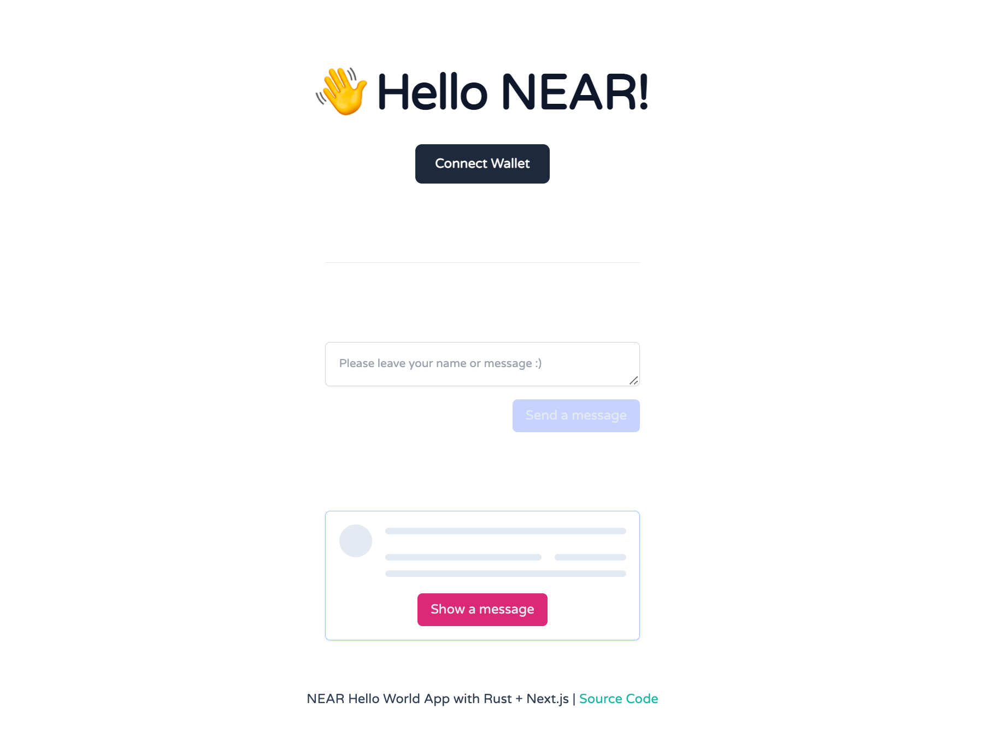

NEAR Hello World App
---

[Challenge #2 - Hello World Smart Contract](https://nearspring.splashthat.com/)

- [Demo](https://near-helloworld-app.vercel.app)



Build with:

- Contract - Rust
- Frontend - Next.js
- Hosted - Vercel

## Abstract

> Build and deploy a frontend for your smart contract (GitHub Pages is the most simple option). The user should enter their name, call the contract, and see "Hello {name}!"

```
// write the given name and save "Hello {message}!" to contract storage.
export function hello(message: string): string {}

// read a message by account_id from contract storage.
export function get_hello(account_id: AccountId): string {}
```

## Usage

Build a contract to WASM

```
make build
```

Deploy a contract to testnet

```
make deploy
```

Run a frontend

```
# development
yarn dev

# Prod mod
yarn build
yarn start
```

## Interact with Contract (CLI)

Get a hello message. (default is "not found")

> Note: `helloworld.0xchai.testnet` is my default contract, If you deploy with your contract you need to update in `.env` file and makefile script (deploy).

```bash
near view helloworld.0xchai.testnet get_hello '{"account_id": "<your_near_id>"}'
```

Send a message.

```bash
near call helloworld.0xchai.testnet hello '{"message": "<message>"}' --account_id=<your_near_id>
```

## Reference

- [near-sdk](https://www.near-sdk.io/)
- [NEAR Example - Status Message](https://github.com/near-examples/rust-status-message)
- [NEAR Example - Rust Counter](https://github.com/near-examples/rust-counter)
- [Create Near App](https://github.com/near/create-near-app)
